# 第1章：React入门
## 1.1. React简介
### 1.1.1. 官网
1.	英文官网: https://reactjs.org/
2.	中文官网: https://react.docschina.org/
### 1.1.2. 介绍描述
1.	用于动态构建用户界面的 JavaScript 库(只关注于视图)
2.	由Facebook开源
### 1.1.3. React的特点
1.	声明式编码
2.	组件化编码
3.	React Native 编写原生应用
4.	高效（优秀的Diffing算法）
### 1.1.4. React高效的原因
1.	使用虚拟(virtual)DOM, 不总是直接操作页面真实DOM。
2.	DOM Diffing算法, 最小化页面重绘。
## 1.2. React的基本使用
### 1.2.1. 效果

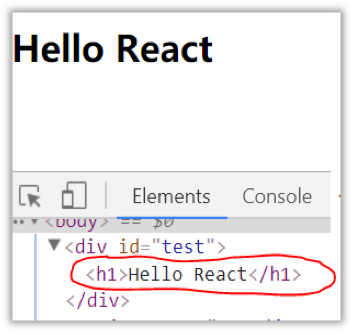

### 1.2.2. 相关js库
1.	react.js：React核心库。
2.	react-dom.js：提供操作DOM的react扩展库。
3.	babel.min.js：解析JSX语法代码转为JS代码的库。
### 1.2.3. 创建虚拟DOM的两种方式

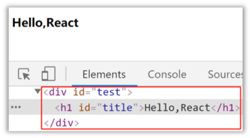

1.	纯JS方式(一般不用)
2.	JSX方式
### 1.2.4. 虚拟DOM与真实DOM
1.	React提供了一些API来创建一种 “特别” 的一般js对象
    - const VDOM = React.createElement('xx',{id:'xx'},'xx')
    - 上面创建的就是一个简单的虚拟DOM对象
2.	虚拟DOM对象最终都会被React转换为真实的DOM
3.	我们编码时基本只需要操作react的虚拟DOM相关数据, react会转换为真实DOM变化而更新界。
## 1.3. React JSX
### 1.3.1. 效果

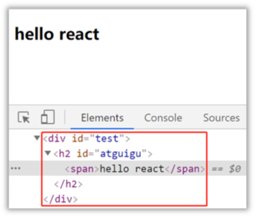

### 1.3.2. JSX
1.	全称:  JavaScript XML
2.	react定义的一种类似于XML的JS扩展语法: JS + XML本质是React.createElement(component, props, ...children)方法的语法糖
3.	作用: 用来简化创建虚拟DOM 
    - 写法：var ele = <h1>Hello JSX!</h1>
    - 注意1：它不是字符串, 也不是HTML/XML标签
    - 注意2：它最终产生的就是一个JS对象
4.	标签名任意: HTML标签或其它标签
5.	标签属性任意: HTML标签属性或其它
6.	基本语法规则
    - 遇到 <开头的代码, 以标签的语法解析: html同名标签转换为html同名元素, 其它标签需要特别解析
    - 遇到以 { 开头的代码，以JS语法解析: 标签中的js表达式必须用{ }包含
7.	babel.js的作用
    - 浏览器不能直接解析JSX代码, 需要babel转译为纯JS的代码才能运行
    - 只要用了JSX，都要加上type="text/babel", 声明需要babel来处理
### 1.3.3. 渲染虚拟DOM(元素)
1.	语法:  ReactDOM.render(virtualDOM, containerDOM)
2.	作用: 将虚拟DOM元素渲染到页面中的真实容器DOM中显示
3.	参数说明
    - 参数一: 纯js或jsx创建的虚拟dom对象
    - 参数二: 用来包含虚拟DOM元素的真实dom元素对象(一般是一个div)
### 1.3.4. JSX练习
需求: 动态展示如下列表

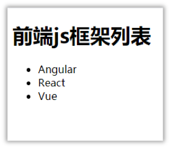

## 1.4. 模块与组件、模块化与组件化的理解
### 1.4.1. 模块
1.	理解：向外提供特定功能的js程序, 一般就是一个js文件
2.	为什么要拆成模块：随着业务逻辑增加，代码越来越多且复杂。
3.	作用：复用js, 简化js的编写, 提高js运行效率
### 1.4.2. 组件
1.	理解：用来实现局部功能效果的代码和资源的集合(html/css/js/image等等)
2.	为什么要用组件： 一个界面的功能更复杂
3.	作用：复用编码, 简化项目编码, 提高运行效率
### 1.4.3. 模块化
当应用的js都以模块来编写的, 这个应用就是一个模块化的应用
### 1.4.4. 组件化
当应用是以多组件的方式实现, 这个应用就是一个组件化的应用

# 第2章：React面向组件编程
## 2.1. 基本理解和使用
### 2.1.1. 使用React开发者工具调试
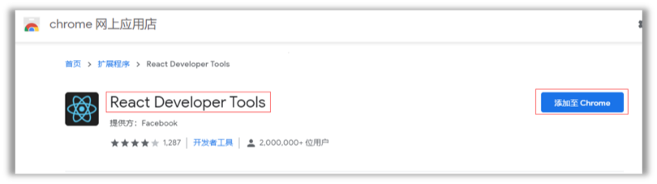

### 2.1.2. 效果
- 函数式组件：

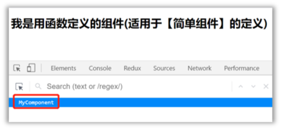

- 类式组件：

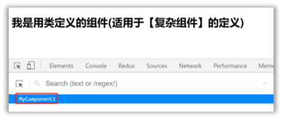

### 2.1.3. 注意
1.	组件名必须首字母大写
2.	虚拟DOM元素只能有一个根元素
3.	虚拟DOM元素必须有结束标签
### 2.1.4. 渲染类组件标签的基本流程
1.	React内部会创建组件实例对象
2.	调用render()得到虚拟DOM, 并解析为真实DOM
3.	插入到指定的页面元素内部
## 2.2. 组件三大核心属性1: state
### 2.2.1. 效果
需求: 定义一个展示天气信息的组件
1.	默认展示天气炎热 或 凉爽
2.	点击文字切换天气
### 2.2.2. 理解
1.	state是组件对象最重要的属性, 值是对象(可以包含多个key-value的组合)
2.	组件被称为"状态机", 通过更新组件的state来更新对应的页面显示(重新渲染组件)
### 2.2.3. 强烈注意
1.	组件中render方法中的this为组件实例对象
2.	组件自定义的方法中this为undefined，如何解决？
    - 强制绑定this: 通过函数对象的bind()
    - 箭头函数
3.	状态数据，不能直接修改或更新
## 2.3. 组件三大核心属性2: props
### 2.3.1. 效果
需求: 自定义用来显示一个人员信息的组件
1.	姓名必须指定，且为字符串类型；
2.	性别为字符串类型，如果性别没有指定，默认为男
3.	年龄为字符串类型，且为数字类型，默认值为18

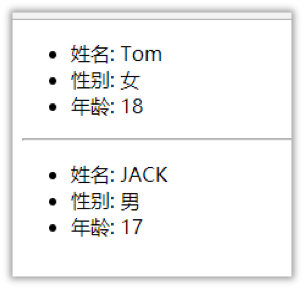

### 2.3.2. 理解
1.	每个组件对象都会有props(properties的简写)属性
2.	组件标签的所有属性都保存在props中
### 2.3.3. 作用
1.	通过标签属性从组件外向组件内传递变化的数据
2.	注意: 组件内部不要修改props数据
### 2.3.4. 编码操作
1.	内部读取某个属性值
```
this.props.name
```
2.	对props中的属性值进行类型限制和必要性限制
- 第一种方式（React v15.5 开始已弃用）：
```
Person.propTypes = {
 name: React.PropTypes.string.isRequired,
 age: React.PropTypes.number
}
```
- 第二种方式（新）：使用prop-types库进限制（需要引入prop-types库）
```
Person.propTypes = {
  name: PropTypes.string.isRequired,
  age: PropTypes.number. 
}
```
3.	扩展属性: 将对象的所有属性通过props传递
```
<Person {...person}/>
```
4.	默认属性值：
```
Person.defaultProps = {
  age: 18,
  sex:'男'
}
```
5.	组件类的构造函数
```
constructor(props){
  super(props)
  console.log(props)//打印所有属性
}
```
## 2.4. 组件三大核心属性3: refs与事件处理
### 2.4.1. 效果
需求: 自定义组件, 功能说明如下:
  1. 点击按钮, 提示第一个输入框中的值
  2. 当第2个输入框失去焦点时, 提示这个输入框中的值
### 2.4.2. 理解
组件内的标签可以定义ref属性来标识自己
### 2.4.3. 编码
1.	字符串形式的
```
<input ref="input1"/>
```
2.	回调形式的ref
```
<input ref={(c)=>{this.input1 = c}}/>
```
3.	createRef创建ref容器
```
myRef = React.createRef() 
<input ref={this.myRef}/>

```
### 2.4.4. 事件处理
1.	通过onXxx属性指定事件处理函数(注意大小写)
    - React使用的是自定义(合成)事件, 而不是使用的原生DOM事件
    - React中的事件是通过事件委托方式处理的(委托给组件最外层的元素)
2.	通过event.target得到发生事件的DOM元素对象

## 2.5. 收集表单数据
### 2.5.1. 效果
需求: 定义一个包含表单的组件
  输入用户名密码后, 点击登录提示输入信息
### 2.5.2. 理解
包含表单的组件分类
1.	受控组件
2.	非受控组件
## 2.6. 组件的生命周期
### 2.6.1. 效果
需求:定义组件实现以下功能：
1. 让指定的文本做显示 / 隐藏的渐变动画
2. 从完全可见，到彻底消失，耗时2S
3. 点击“不活了”按钮从界面中卸载组件
### 2.6.2. 理解
1.	组件从创建到死亡它会经历一些特定的阶段。
2.	React组件中包含一系列勾子函数(生命周期回调函数), 会在特定的时刻调用。
3.	我们在定义组件时，会在特定的生命周期回调函数中，做特定的工作。
### 2.6.3. 生命周期流程图(旧)

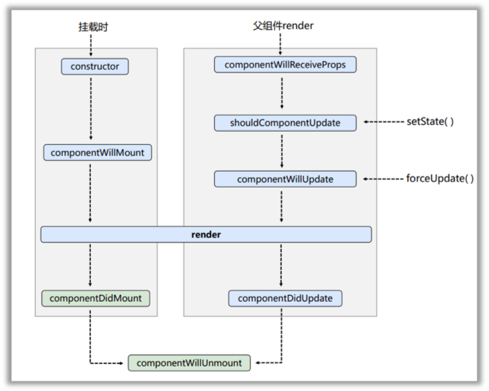

生命周期的三个阶段（旧）
1. 初始化阶段: 由ReactDOM.render()触发---初次渲染
    1.	constructor()
    2.	componentWillMount()
    3.	render()
    4.	componentDidMount()
2. 更新阶段: 由组件内部this.setSate()或父组件重新render触发
    1.	shouldComponentUpdate()
    2.	componentWillUpdate()
    3.	render()
    4.	componentDidUpdate()
3. 卸载组件: 由ReactDOM.unmountComponentAtNode()触发
    1.	componentWillUnmount()

### 2.6.4. 生命周期流程图(新)

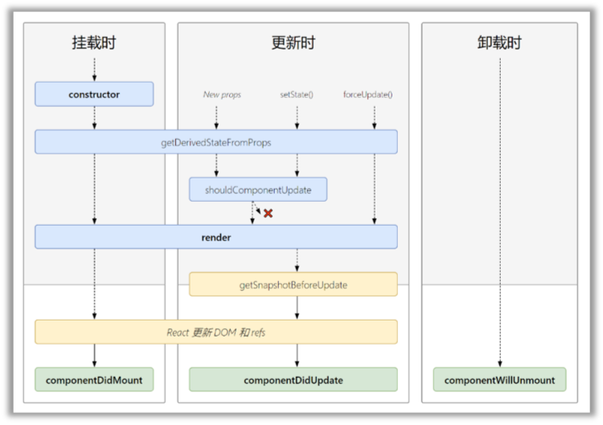

生命周期的三个阶段（新）
1. 初始化阶段: 由ReactDOM.render()触发---初次渲染
    1.	constructor()
    2.	getDerivedStateFromProps 
    3.	render()
    4.	componentDidMount()
2. 更新阶段: 由组件内部this.setSate()或父组件重新render触发
    1.	getDerivedStateFromProps
    2.	shouldComponentUpdate()
    3.	render()
    4.	getSnapshotBeforeUpdate
    5.	componentDidUpdate()
3. 卸载组件: 由ReactDOM.unmountComponentAtNode()触发
    1.	componentWillUnmount()

### 2.6.5. 重要的勾子
1.	render：初始化渲染或更新渲染调用
2.	componentDidMount：开启监听, 发送ajax请求
3.	componentWillUnmount：做一些收尾工作, 如: 清理定时器
### 2.6.6. 即将废弃的勾子
现在使用会出现警告，下一个大版本需要加上UNSAFE_前缀才能使用，以后可能会被彻底废弃，不建议使用。
1.	componentWillMount
2.	componentWillReceiveProps
3.	componentWillUpdate

## 2.7. 虚拟DOM与DOM Diffing算法
### 2.7.1. 基本原理图
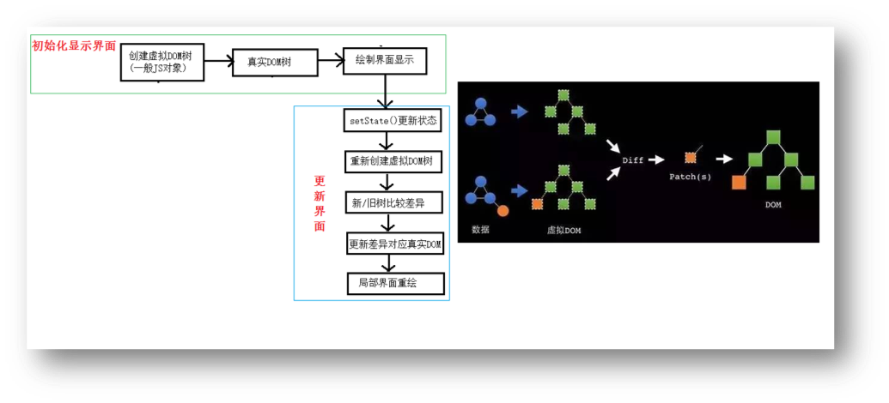


